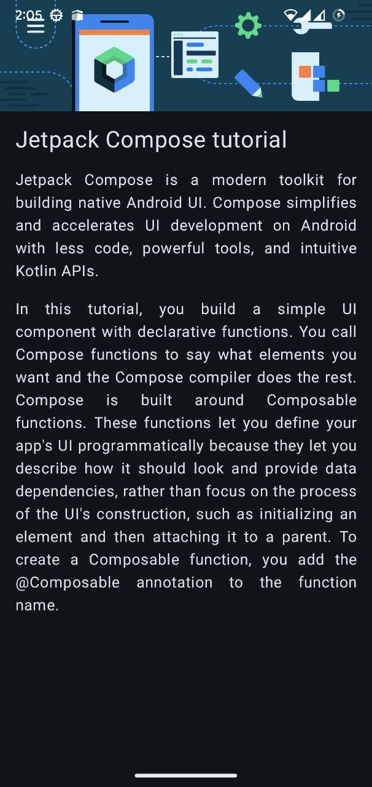

# Compose Article App 📄

This project is part of Unit 1 of the "Android Basics with Compose" course. It's a static Android app that mimics the appearance of a simple online article, complete with a heading, an image, and two paragraphs of text.

## Project Overview

The purpose of this app was to learn how to arrange UI elements vertically and apply padding for better visual spacing.

## Screenshot

## Key Learnings

* Using the `Column` composable to arrange items vertically.
* Applying padding to elements using `Modifier.padding()`.
* Integrating `Image` and `Text` composables within a structured layout.
